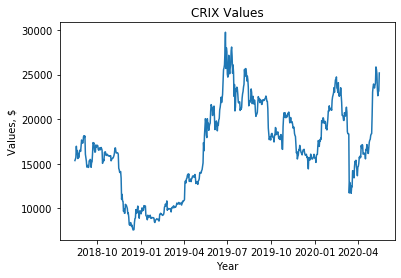
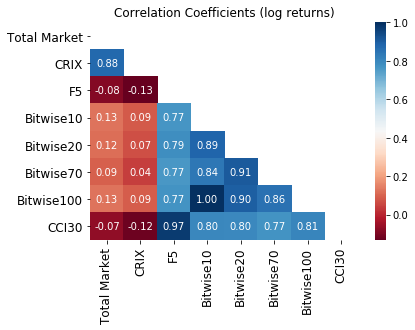
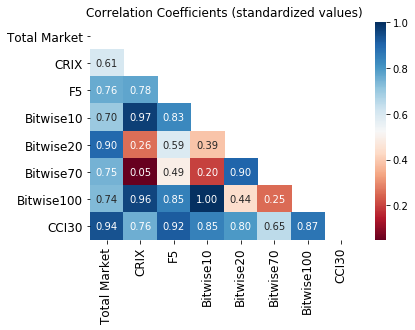
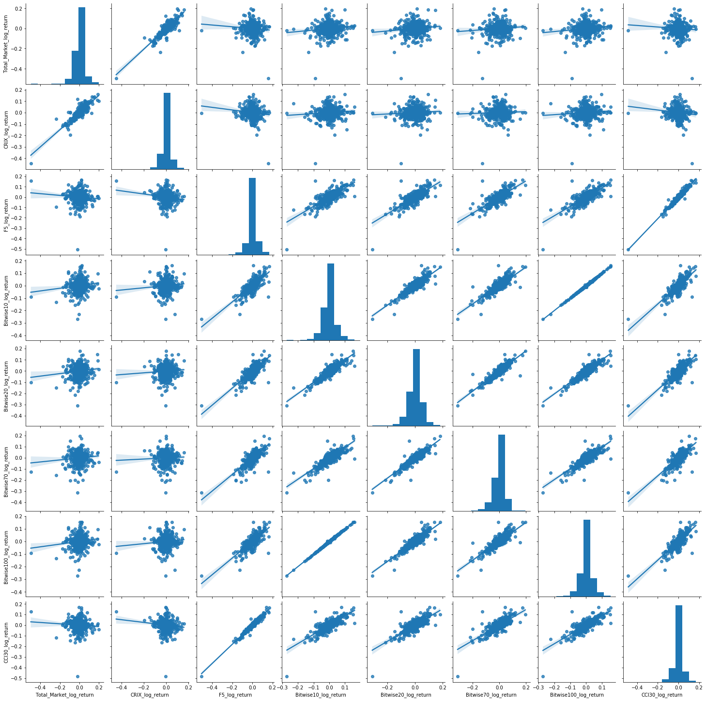
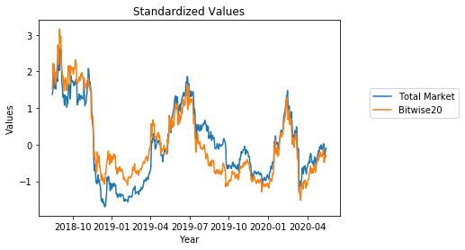
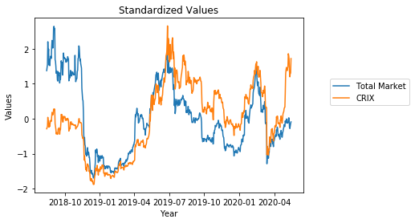
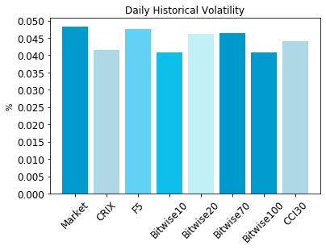

[](http://quantlet.de/)

## [](http://quantlet.de/) **DEDA_2020SS_CRIX_vs_Other_Indices** [](http://quantlet.de/)

```yaml


Name of Quantlet: 'DEDA_2020SS_CRIX_vs_Other_Indices'

Published in: 'DEDA class 2020SS'

Description: 'Comparison of the performance of CRIX against other cryptocurreny indices and the total crypto market.'

Keywords: 'CRIX, total market, values, returns, correlation'

Author: 'Davide Balistreri, Vafa Ganbarova'

Submitted:  '23. July 2020, Vafa Ganbarova, Davide Balistreri'

Datafile: 'indices.xlsx'

```



















### [IPYNB Code: DEDA_2020SS_CRIX_vs_Other_Indices.ipynb](DEDA_2020SS_CRIX_vs_Other_Indices.ipynb)


automatically created on 2020-07-23