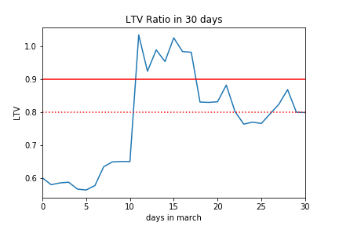
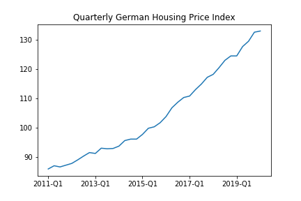
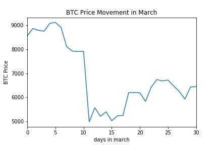
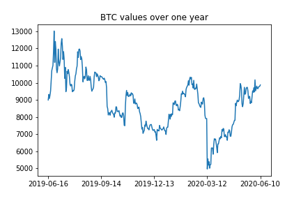

[](http://quantlet.de/)

## [](http://quantlet.de/) **P2P_Case_Study** [](http://quantlet.de/)

```yaml

Name of Quantlet: 'P2P_Case_Study'

Published in: 'DEDA Class SS2020'

Description: 'Illustration of possible behaviour of LTV Ratios in a Crypto-based P2P Lending contract using historical Bitcoin prices'

Keywords: 'bitcoin, crypto collateral, p2p lending, ltv ratio, collateralized loans'

Author: 'Ramona Merkl'

```









### [IPYNB Code: P2P_Case_Study.ipynb](P2P_Case_Study.ipynb)


automatically created on 2020-08-03