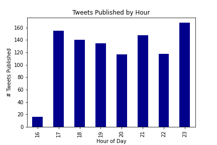
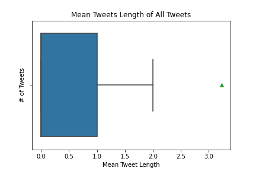
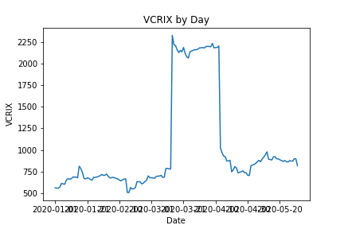
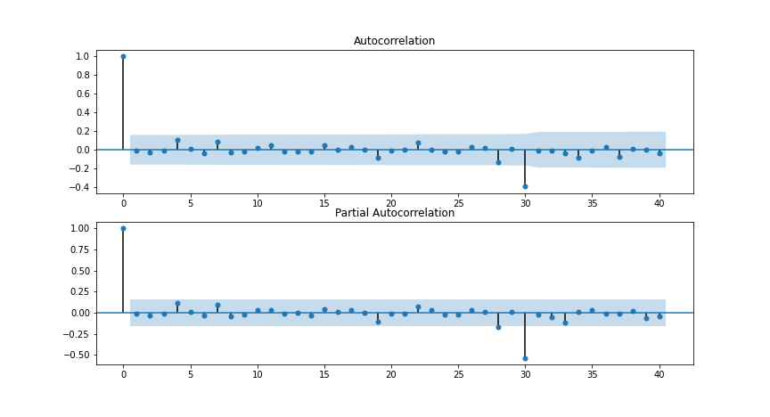
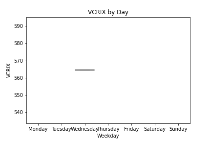
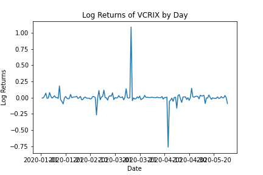

[](http://quantlet.de/)

## [](http://quantlet.de/) **eda** [](http://quantlet.de/)

```yaml


Name of Quantlet: 'eda'

Published in: 'DEDA_Class_2020SS'

Description: 'Exploratory Data Analysis for the final data frame that consists of tweet sentiments, google trend and market data'

Keywords: 'EDA, Sentiments, Exploration, Trends, Cryptocurrencies, Time Series'

Author: 'Fabian Schmidt'

```
















### [IPYNB Code: eda.ipynb](eda.ipynb)


automatically created on 2020-07-27