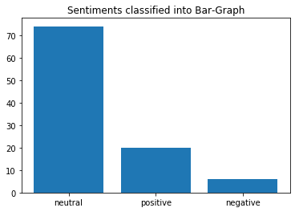

[](http://quantlet.de/)

## [](http://quantlet.de/) **DEDA_2020_Sentiment-Analysis-of-Cryptocurriencies** [](http://quantlet.de/)

```yaml

Name of Quantlet: 'DEDA_2020_Sentiment-Analysis-of-Cryptocurriencies'
Published in: 'DEDA class 2020SS'
Description: 'This Project uses Twitter API to analyse the sentiments of Cryptocurriencies '
Keywords: 'Sentiment-Analysis, Sentiment, CRIX, Bitcoin, cryptocurrency'
Author: 'Sukanya Bhattacharyya, Shubham Senger'
Submitted: '30. July 2020'

```




