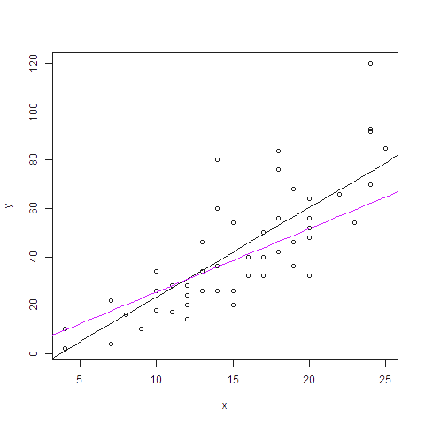
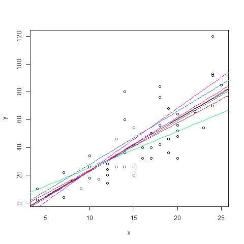

[](http://quantlet.de/)

## [](http://quantlet.de/) **DEDA_class_2020SS_Genetic_Algorithm** [](http://quantlet.de/)

```yaml

Name of Quantlet: 'DEDA_class_2020SS_Genetic_Algorithm'

Published in: DEDA_Class_2020SS

Description: 'R codes used for a DEDA talk on GA. The first part shows how canonical GA finds maxima, 
the second part is Linear Regression using a default dataset in R.'

Keywords: 
- Genetic Algorithm
- Canonical GA
- Linear Regression
- R
- 'R Built-in Data Sets'

Author: Ang Li

Submitted: 20200615 Ang Li, HU Berlin LvB BRC visitor


```






### R Code
```r

## Example 1: using Canonical GA to find maxima
if(!require(GA))
{install.packages("GA")
  require(GA)
}

f <- function(x)  (x+1)*(x-7)*(x-30)*(x-57)*(x-64)*(x-90)*(x-122)*(x-130)*10^(-10)+400
curve(f, from = 0, to = 126, n = 1000)

pop1st<-matrix(NA,10,7)
popfinal<-pop1st
monitor <- function(obj) 
{ 
  if(obj@iter==1) pop1st<<-obj@population
  if(obj@iter==obj@maxiter) popfinal<<-obj@population
  #points(obj@population, pch = 20, col = 2)
}

result <- ga(type = "binary", 
             fitness = function(x){x<-binary2decimal(x);f(x)},
             nBits = 7,popSize = 10,maxiter = 60,
             selection = gabin_rwSelection,elitism = 0,
             crossover = gabin_spCrossover,
             monitor = monitor)
summary(result)
plot(result)

pop1st<-apply(pop1st,1,binary2decimal)
popfinal<-apply(popfinal,1,binary2decimal)

curve(f, 0, 126)
points(pop1st,f(pop1st))
sapply(pop1st,function(x)lines(c(x,x),c(0,f(x)),lty=3))

curve(f, 0, 126)
points(popfinal,f(popfinal))
sapply(popfinal,function(x)lines(c(x,x),c(0,f(x)),lty=3))

## Example 2: Simple application of GA to Linear Regression

if(!require(GA))
  {install.packages("GA")
  require(GA)
  }

require(stats4)

setwd('D:/')

x<-cars$speed
y<-cars$dist
n<-length(x)

#L<-function(beta0,beta1,sigma2) -n*log(sigma2)-sum((beta0+beta1*x-y)^2)/sigma2
#this form Likelihood function can't prevent sigma2 from being negtive during optimization

L<-function(beta0,beta1,sigma) -sum(dnorm(y,beta0+beta1*x,sigma,log = TRUE))
k.mle<-coef(mle(L,start = list(beta0=1,beta1=0,sigma=1)))
k.mle<-c(k.mle[1],k.mle[2])

x.ols<-cbind(1,x)
k.ols<-solve(t(x.ols)%*%x.ols,t(x.ols))%*%y

f<-function(k) -sum((k[1]+k[2]*x-y)^2)
maxiter <- 100
k.ga<-matrix(NA,maxiter,2)
#coef gained by GA, iter num is 30
monitor <- function(obj) 
{ 
  obj@fitnessValue <- max(obj@fitness, na.rm = TRUE)
  valueAt <- which(obj@fitness == obj@fitnessValue)
  solution <- obj@population[valueAt,,drop=FALSE]
  if(nrow(solution) > 1)
  { # find unique solutions to precision given by default tolerance
    eps <- gaControl("eps")
    solution <- unique(round(solution/eps)*eps, margin = 1)
  }
  k.ga[obj@iter,]<<-solution
}
GA.result<-ga("real-valued",f,
          lower=c(-40,0),
          upper = c(40,100),
          maxiter = maxiter,
          monitor = monitor)

##plotting
png(paste("fig_LR",0,".png",sep=""))
plot(x,y)
curve(k.mle[1]+k.mle[2]*x,from = 0,to=30,col="black",add = TRUE)
dev.off()
plotcol<-rep(rainbow(5),maxiter/5)# integer division
for(i in 1:maxiter){ 
  png(paste("fig_LR",i,".png",sep=""))
  plot(x,y)
  curve(k.ols[1]+k.ols[2]*x,from = 0,to=30,col="black",add = TRUE)
  for(j in 1:i)
    curve(k.ga[j,1]+k.ga[j,2]*x,from = 0,to=30,col=plotcol[j],add = TRUE)
  dev.off()
  }

```

automatically created on 2020-07-13