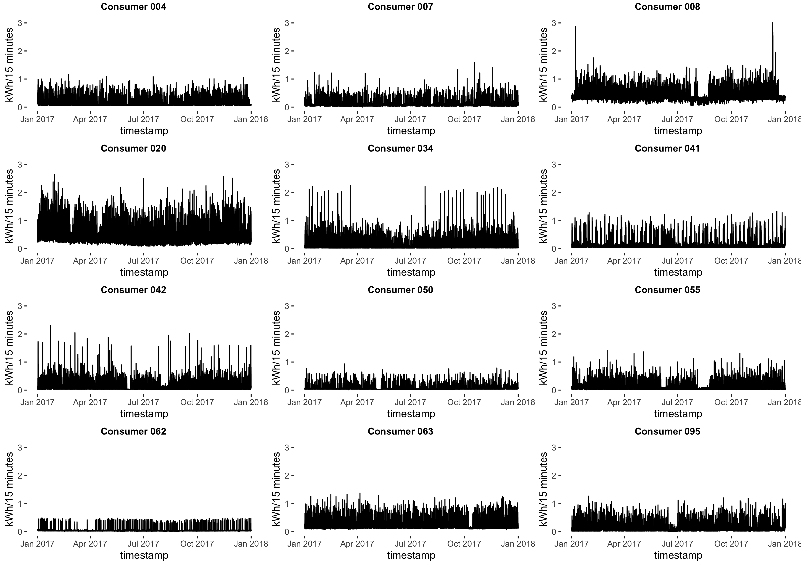
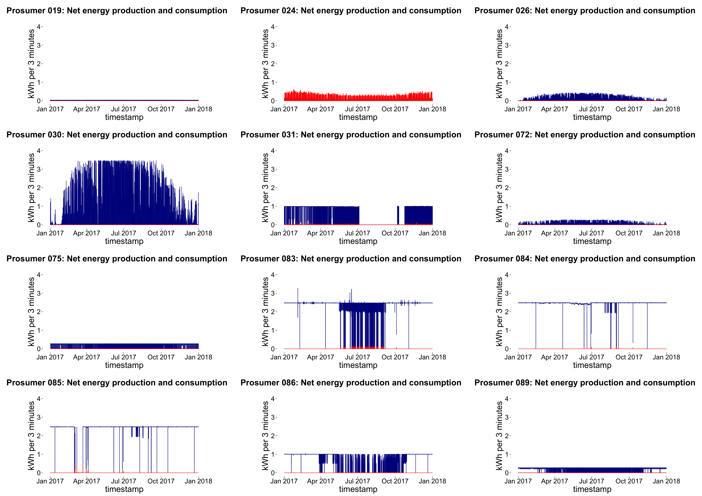
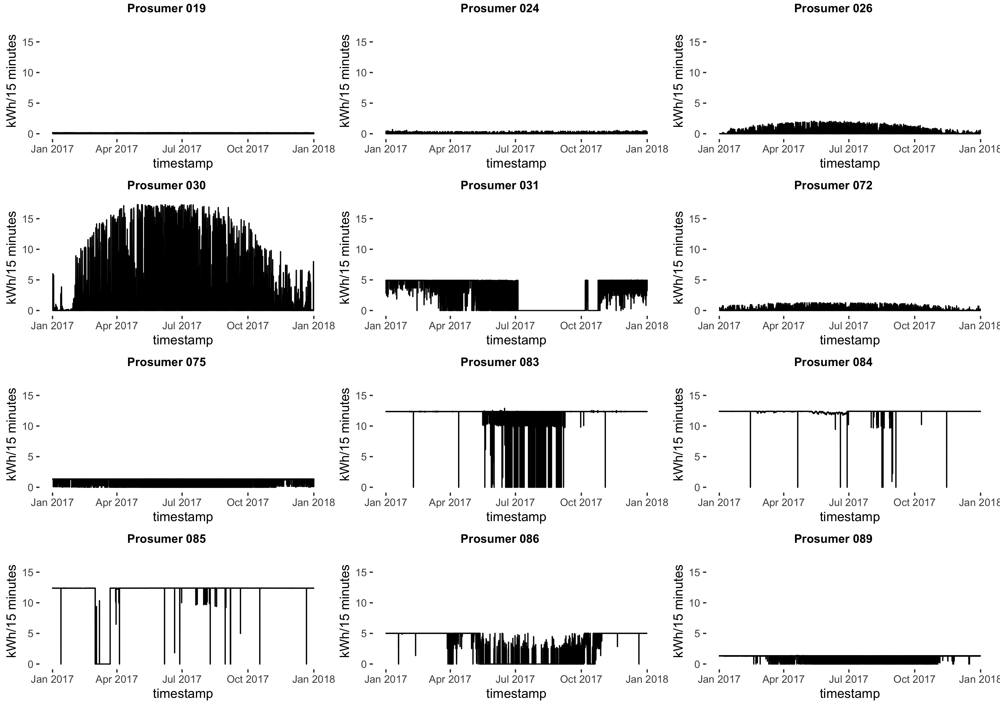

[](http://quantlet.de/)

## [](http://quantlet.de/) **‘Energy_Prosumer_1_Descriptive_Statistics_of_energy_data'** [](http://quantlet.de/)

```yaml


Name of Quantlet: ‘Energy_Prosumer_1_Descriptive_Statistics_of_energy_data'

Published in: 'DEDA_class_2020SS'

Description: ‘Descriptive statistics of energy data imports and plots the data for energy production and consumption.'

Keywords: 'data visualisation, energy consumption, energy production, net production, line graph'

Author: 'Anna-Lena Hock and Sabrina Daun'

See also: ' - Energy_Prosumer_2_Battery_Simulation
            - Energy_Prosumer_3_Market_Simulation_with_Battery
            - Energy_Prosumer_4_Market_Simulation_without_Battery'

Submitted:  '06.08.2020'

Datafile:
- 100 consumer datasets (named "consumer-00000xxx.csv")
- 100 prosumer datasets (named "producer-00000xxx.csv")

Input: 100 consumer/prosumer data sets containing energy consumption/production in 3-minute intervals for one year (2017) from  https://github.com/QuantLet/BLEM/tree/master/data

Output: plots of consumer/prosumer's energy consumption/production and plot of net energy production/consumption

```





