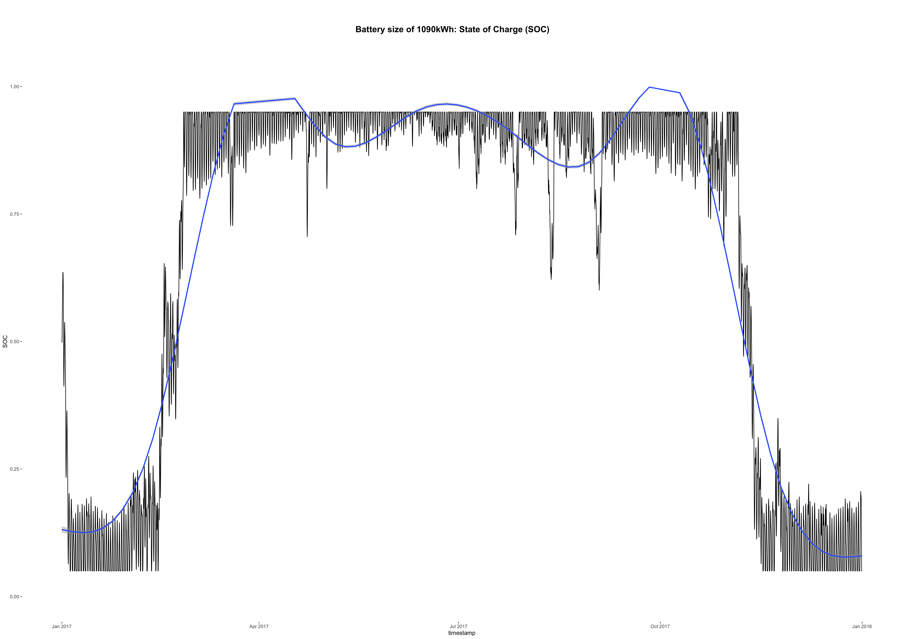

[](http://quantlet.de/)

## [](http://quantlet.de/) **‘Energy_Prosumer_2_Battery_Simulation'** [](http://quantlet.de/)

```yaml


Name of Quantlet: ‘Energy_Prosumer_2_Battery_Simulation'

Published in: 'DEDA_class_2020SS'

Description: 'Battery simulation: the net energy load is calculated by subtracting aggregate consumption from aggregate production by prosumers. Then, a simulation of six different battery sizes is done.'

Keywords: 'energy consumption, energy production, net load, battery simulation, line graph'

Author: 'Anna-Lena Hock and Sabrina Daun'

See also: ' - Energy_Prosumer_1_Descriptive_Statistics_of_energy_data
            - Energy_Prosumer_3_Market_Simulation_with_Battery
            - Energy_Prosumer_4_Market_Simulation_without_Battery'

Submitted:  '06.08.2020'

Datafile:
- 100 consumer datasets (named "consumer-00000xxx.csv")
- 100 prosumer datasets (named "producer-00000xxx.csv")

Input: 100 consumer/prosumer data sets containing energy consumption/production in 3-minute intervals for one year (2017) from  https://github.com/QuantLet/BLEM/tree/master/data

Output: csv-files containing energy production data in 15-minute time interval, self-consumption of prosumers, net production of prosumers, consumption of consumers,  aggregate production and consumption, net load and battery simulation; plotted battery simulation


```

